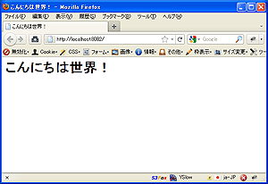

==========================
アプリケーションを作成する
==========================

AppEngine用のアプリケーションを作成します。

新規にアプリケーションを作成する
================================

新規アプリケーションの作成は ``scaffold`` コマンドを実行します。
このドキュメントでは `engineapp` という名前のアプリケーションを作成します。

::

   $ scaffold create tokky.appengine.core
   application_name: engineapp

これで雛型からアプリケーションディレクトリが作成されました。

AppEngineの開発サーバを起動して、確認してみます。

::

   $ cd engineapp
   $ dev_appserver.py .

起動したアドレスをウェブブラウザで開いてみてください。
何も設定していない状態では `404 not Found.` と表示されるはずです。

トップページを有効にする
========================

トップページを有効にしてみましょう。

engineapp ディレクトリ内の ``config.py`` というファイルをエディタで開き、 ``APPS`` の ``toppage`` と書かれた行のコメントアウトを消してください。

.. code-block:: python

   # installed apps
   APPS = [
       (r'^/$', 'apps.toppage.application'),
   ]

これでトップページが有効になりました。
保存して、ウェブブラウザでもう一度開いてみると、 `hello world!` と表示されます。

.. image:: static/helloworld.png

トップページのテンプレートを変更する
====================================

有効にしたトップページの表示を変更してみましょう。

このページは `Django テンプレート`_ ファイルからHTMLを生成しています。
テンプレートファイルは ``engineapp/templates/index.html`` にあります。

ファイルを次のように編集して保存します。

.. code-block:: html+django

   <html>
     <head>
       <meta http-equiv="Content-type" content="text/html; charset=UTF-8"/>
       <title>こんにちは世界！</title>
     </head>
     <body>
     <h1>こんにちは世界！</h1>
     </body>
   </html>

.. note:: 日本語の内容を含むテンプレートファイルは、文字コードをUTF-8にして保存します。

ウェブブラウザでトップページをリロードすると、表示が変更されたことを確認できます。

.. _`Django テンプレート`: https://docs.djangoproject.com/en/dev/topics/templates/

仕組みを知る
============

テンプレートファイルを使用してページを表示する仕組みについて見てみましょう。

トップページのアプリケーションハンドラは、 ``engineapp/apps/toppage.py`` モジュールにあります。
ファイルをエディタで開いてみて見ましょう。

解説のコメントを加えたものを次に示します。

.. code-block:: python

   from google.appengine.ext import webapp

   from core.generics import TemplatePageHandler

   import config

   # テンプレートファイルを使ってページを表示するクラスの定義
   class TopPageHandler(TemplatePageHandler):
       template_name = 'templates/index.html'  # このハンドラで使うテンプレートのパス

   # このトップページアプリケーションのエントリーポイント(WSGIアプリケーション)
   # webapp.WSGIApplicationをそのまま使用します
   application = webapp.WSGIApplication([
       (r'/', TopPageHandler),
       ], debug=config.DEBUG)

ここで使用している ``TemplatePageHandler`` は、 ``webapp.RequestHandler`` を継承したクラスです。
``TemplatePageHandler`` は ``template_name`` で使用するテンプレートファイルのパスを指定します。

モジュール内で定義された ``application`` は ``webapp.WSGIApplication`` を使用したWSGIアプリケーションの形になっています。
最初に書き換えた ``config.py`` の ``APPS`` 部分をもう一度見てみましょう。

.. code-block:: python

   # installed apps
   APPS = [
       (r'^/$', 'apps.toppage.application'),
   ]

``APPS`` のリスト内には、正規表現とアプリケーションハンドラ(WSGIアプリケーション)のインポート名をタプルで記述しています。
tokky.appengine.core では、このリスト内のタプルを順に参照し、URLに最初にマッチしたアプリケーションハンドラをロードして実行します。

アプリケーションハンドラはURLにマッチしない限り、ロードされません。これは、スピンアップ時のパフォーマンス向上と、メモリ使用量の節約にも貢献しています。
